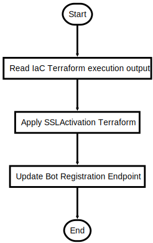

# ActivateSSL.ps1

Activate Custom Domain Name SSL Certificate and activate TrafficManager Endpoints

## Description

Activate Custom Domain Name SSL Certificate and activate TrafficManager Endpoints

This script will do following steps:

1. Import information from previous Terraform runs
2. Terraform execution to activate certificate and map TrafficManager endpoints
3. Update Bot Endpoint

After the script is successfully executed the bot should be in a usable state from WebChat

## Parameters

| Name | Type | Required | Default | Description |
| - | - | - | - | - |
| YOUR_DOMAIN | String | false |  | The domain (CN) name for the SSL certificate |
| AUTOAPPROVE | Boolean | false | False | Terraform and SSL creation Automation Flag. $False -> Interactive, Approval $True -> Automatic Approval |
| KEYVAULT_CERT_NAME | String | false | SSLcert | KeyVault certificate key name |

## Examples

```powershell
.\ActivateSSL.ps1 -YOUR_DOMAIN bot.mydomain.com

```


## Related Scripts
- [InitTerraform.ps1](InitTerraform.md)


## Flowchart

<div align='center'>


</div>
