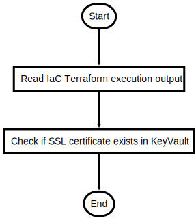

# CheckExistingSSL.ps1

Check if already a SSL certificate was imported to KeyVault

## Description

Check if already a SSL certificate was imported to KeyVault

This script will do following steps:

1. Read values from Terraform IaC run (Bot deployment scripts)
2. Check if certificate exists in Key Vault

Returns $True if certificate already exists

## Parameters

| Name | Type | Required | Default | Description |
| - | - | - | - | - |
| KEYVAULT_CERT_NAME | String | false | SSLcert | KeyVault certificate key name |

## Examples

```powershell
.\CheckExistingSSL.ps1 -KEYVAULT_CERT_NAME SSLcert

```


## Flowchart

<div align='center'>


</div>
