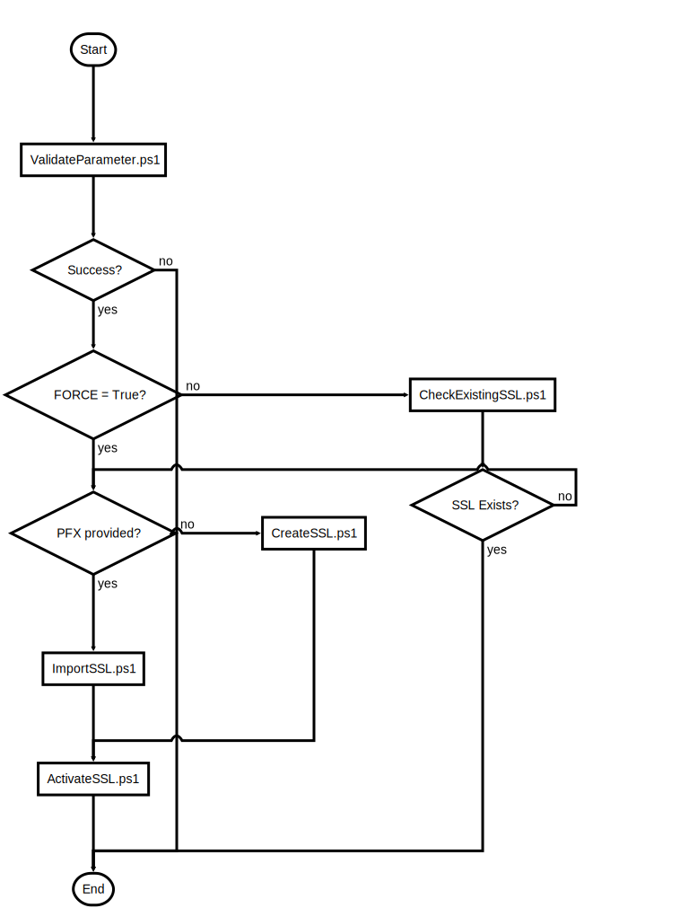

# CreateOrImportSSL.ps1

Import existing or create/issue new SSL certificate

## Description

Import existing or create/issue new SSL certificate

This script will do following steps:

1. Validate Parameters

2. Deactivate SSL Endpoints (in FORCE mode e.g. changing certificate or changing to custom domain name)

In Import Mode
  3. Execute Import script

In Issuing Mode
  3. Execute Issuing script

4. Terraform execution to activate certificate

After the script is successfully executed the Bot should be in a usable from within Bot Framework Service (WebChat) and Bot Emulator

## Parameters

| Name | Type | Required | Default | Description |
| - | - | - | - | - |
| YOUR_CERTIFICATE_EMAIL | String | false |  | Mail to be associated with Let's Encrypt certificate |
| YOUR_DOMAIN | String | false |  | The domain (CN) name for the SSL certificate |
| LETS_ENCRYPT_STAGING | Boolean | false | False | $True -> Use Let's Encrypt staging for script testing (Bot cannot be reached from Bot Framework Service)  |
| PFX_FILE_LOCATION | String | false |  | SSL CERT (PFX Format) file location |
| PFX_FILE_PASSWORD | String | false |  | SSL CERT (PFX Format) file password |
| KEYVAULT_CERT_NAME | String | false | SSLcert | KeyVault certificate key name |
| AUTOAPPROVE | Boolean | false | False | Terraform and SSL creation Automation Flag. $False -> Interactive, Approval $True -> Automatic Approval |
| ALREADYCONFIRMED | Boolean | false | False | Flag to determine if run from within OneClickDeploy.ps1 |
| FORCE | Boolean | false | False | Force Reimport or Reissuing if certificate already exists |
| RERUN | Boolean | false | False | To change existing infrastructure, e.g. skips DNS check. $False -> first run/no infrastructure, $True -> subsequent run, existing infrastructure |

## Examples

```powershell
.\CreateOrImportSSL.ps1 -YOUR_CERTIFICATE_EMAIL my@mymail.com -YOUR_DOMAIN bot.mydomain.com -LETS_ENCRYPT_STAGING $False -AUTOAPPROVE $True

.\CreateOrImportSSL.ps1 -PFX_FILE_LOCATION ../SSL/mybot.pfx -PFX_FILE_PASSWORD securesecret -AUTOAPPROVE $False

```


## Flowchart

<div align='center'>


</div>
