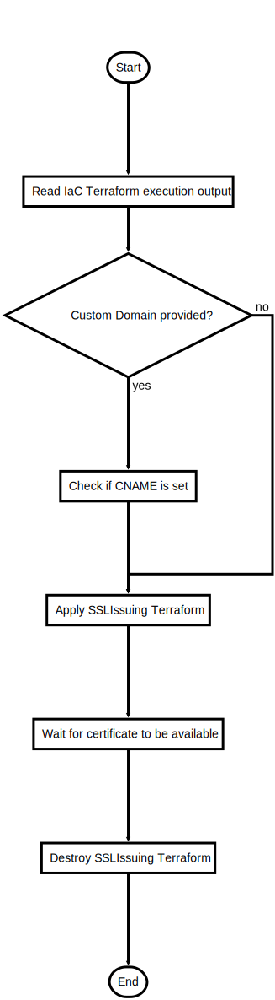

# CreateSSL.ps1

Issue new SSL certificate from Let's Encrypt

## Description

Issue new SSL certificate from Let's Encrypt

This script will do following steps:

1. Read values from previous Infrastructure Deployment run (Terraform & Bot Deployment) 
2. If custom domain is set, check if it points to TrafficManager DNS entry
3. Terraform execution to spin up container who issues SSL cert and stores in KeyVault
4. Check if certificate was created
5. Terraform destroy to clean up resources only need for SSL issuing

After the script is successfully executed the certificate should be stored in KeyVault

## Parameters

| Name | Type | Required | Default | Description |
| - | - | - | - | - |
| YOUR_CERTIFICATE_EMAIL | String | true |  | Mail to be associated with Let's Encrypt certificate |
| YOUR_DOMAIN | String | false |  | The domain (CN) name for the SSL certificate |
| LETS_ENCRYPT_STAGING | Boolean | false | False | $True -> Use Let's Encrypt staging for script testing (Bot cannot be reached from Bot Framework Service)  |
| AUTOAPPROVE | Boolean | false | False | Terraform Automation Flag. $False -> Interactive, Approval $True -> Automatic Approval |
| KEYVAULT_CERT_NAME | String | false | SSLcert | KeyVault certificate key name |
| MAX_WAIT_TIME_MIN | Int32 | false | 15 | Maximum wait time for DNS resolve and certificate generation in minutes. Default 15 min |

## Examples

```powershell
.\CreateSSL.ps1 -YOUR_CERTIFICATE_EMAIL my@mymail.com -YOUR_DOMAIN bot.mydomain.com -LETS_ENCRYPT_STAGING $False -AUTOAPPROVE $True

```


## Related Scripts
- [ActivateSSL.ps1](ActivateSSL.md)


## Flowchart

<div align='center'>


</div>
