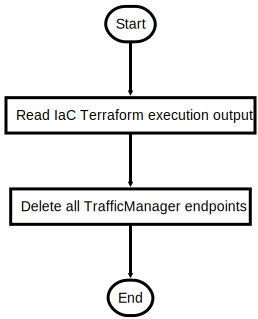

# DeactivateSSL.ps1

Deactivate SSL Certificate when in direct use with TrafficManager Domain

## Description

Deactivate SSL Certificate when in direct use with TrafficManager Domain

This script will do following steps:

1. Read relevant data of TrafficManager from Terraform Infrastructure execution
2. Delete all TrafficManager endpoints, this will also remove the custom domain name entry from WebApps automatically

## Parameters

| Name | Type | Required | Default | Description |
| - | - | - | - | - |

## Examples

```powershell
.\DeactivateSSL.ps1

```


## Flowchart

<div align='center'>


</div>
