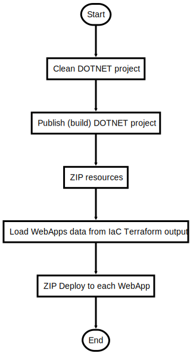

# DeployBot.ps1

Deploys the provided Bot project to all Azure Web App regions

## Description

Deploys the provided Bot project to all Azure Web App regions

This script will do following steps:

1. Publish the .NET Core 2.2 Bot for x64 Windows (see App Service Plan)
2. Compress publish folder to zip file
3. Loads WebApp Account names and resource group names from Terraform output (Terraform CLI)
4. Deploy to WebApps

After the script is successfully executed the bot code is deployed

## Parameters

| Name | Type | Required | Default | Description |
| - | - | - | - | - |
| BOT_PROJECT_FILE | String | false | GeoBot/GeoBot/GeoBot.csproj | Bot Project File  |
| TARGET_RUNTIME | String | false | win-x64 | Target Runtime see https://docs.microsoft.com/en-us/dotnet/core/rid-catalog |
| CONFIGURATION | String | false | release | Configuration release or debug |
| PUBLISH_ARTIFACTS | String | false | GeoBot/GeoBot/bin/release/netcoreapp2.2/win-x64/publish/* | Folder to dotnet publish artifacts  |
| ZIP_FILE_NAME | String | false | botnotselfcontained.zip | Deployment Zip File Name |

## Examples

```powershell
.\DeployBot.ps1

.\DeployBot.ps1 -CONFIGURATION debug

```


## Flowchart

<div align='center'>


</div>
