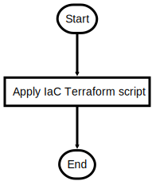

# DeployInfrastructure.ps1

Terraform Deployment of the base infrastructure

## Description

Terraform Deployment of the base infrastructure

This script will do following steps:

1. Determine which variant will be deployed
2. Deploy Infrastructure with Terraform

After the script is successfully executed the Bot can be deployed to WebApps and infrastructure is ready for import 
a SSL certificate and activation of TrafficManager

## Parameters

| Name | Type | Required | Default | Description |
| - | - | - | - | - |
| BOT_NAME | String | true |  | Unique Bot Name -> will be used as DNS prefix for CosmosDB, TrafficManager and KeyVault |
| BOT_REGIONS | String[] | false | @("koreacentral", "southeastasia") | Regions to deploy the Bot to |
| BOT_GLOBAL_REGION | String | false | japaneast | Region used for global services |
| AZUREFRONTDOOR | Boolean | false | False | Distribution Service: TrafficManager or Azure FrontDoor  |
| AUTOAPPROVE | Boolean | false | False | Terraform and SSL creation Automation Flag. $False -> Interactive, Approval $True -> Automatic Approval |

## Examples

```powershell
.\DeployInfrastructure.ps1 -BOT_NAME myuniquebot -AUTOAPPROVE $True

```


## Related Scripts
- [InitTerraform.ps1](InitTerraform.md)


## Flowchart

<div align='center'>


</div>
