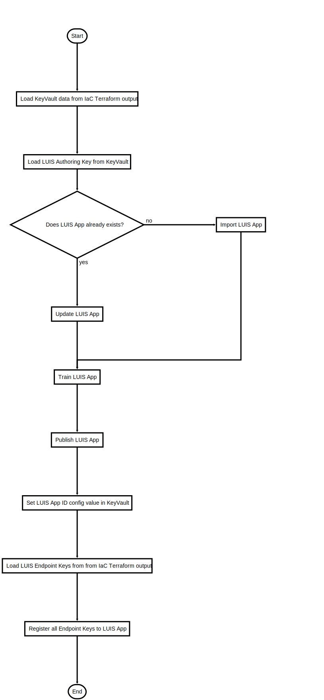

# DeployLUIS.ps1

Deploy LUIS NLP application

## Description

Deploy LUIS NLP application
Remark: There is no support in the Terraform AzureRM provider to do this.

This script will do following steps:

1. Get the authoring key from KeyVault (Azure CLI - Alternative: could be done with Terraform output)
2. Imports the application to LUIS.ai via LUIS JSON model and LUIS cli tool
3. Trains the application on LUIS.ai via LUIS cli tool
4. Publishes the application to production slot on LUIS.ai via LUIS cli tool
5. Sets the LUIS Application Id in KeyVault for distribution to Bot WebApp nodes (Azure CLI)
6. Prepares and imports data necessary for LUIS Endpoint & Key association REST API (using Azure CLI - due to feature lag in LUIS CLI) 
7. Loads LUIS Account names and resource group names from Terraform output (Terraform CLI)
8. Loops to associate every LUIS account with the LUIS application (cURL command)

After successful execution the LUIS app is available trough all regionalized LUIS Cognitive Service endpoints from all created Bots/WebApps

## Parameters

| Name | Type | Required | Default | Description |
| - | - | - | - | - |
| LUIS_APP_NAME | String | false | AddressFinder | LUIS Application Name |
| LUIS_APP_PACKAGE_LOCATION | String | false | GeoBot/GeoBot/CognitiveModels/AddressFinder.json | LUIS Application Package file location (JSON)  |
| LUIS_KEYVAULT_KEY | String | false | LUISAuthoringKey | LUIS Authoring Key KeyVault secret name |

## Examples

```powershell
.\DeployLUIS.ps1

```


## Flowchart

<div align='center'>


</div>
