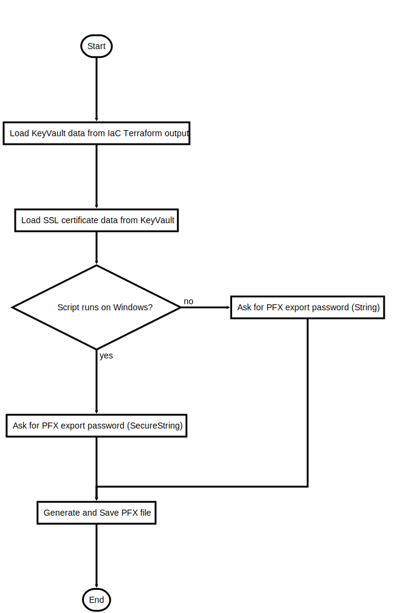

# ExportSSL.ps1

Export SSL Certificate as PFX from KeyVault

## Description

Export SSL Certificate as PFX from KeyVault

This script will do following steps:

1. Read KeyVault information from current Terraform state
2. Export Certificate to file 

After the script is successfully executed the SSL certificate should be saved as PFX file

## Parameters

| Name | Type | Required | Default | Description |
| - | - | - | - | - |
| PFX_FILE_LOCATION | String | false | SSL/<BOT_NAME>.pfx | SSL CERT (PFX Format) file location  |
| KEYVAULT_CERT_NAME | String | false | SSLcert | KeyVault certificate key name |

## Examples

```powershell
.\ExportSSL.ps1

```


## Flowchart

<div align='center'>


</div>
