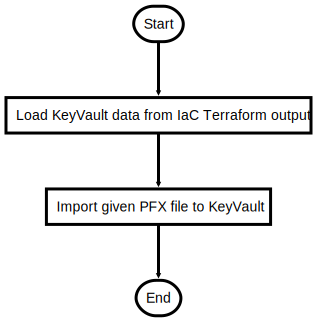

# ImportSSL.ps1

Import existing SSL certificate to KeyVault

## Description

Import existing SSL certificate to KeyVault

This script will do following steps:

1. Load KeyVault values from Terraform Infrastructure run
2. Import PFX/SSL to KeyVault

After the script is successfully executed the Bot should be in a usable from within Bot Framework Service (WebChat) and Emulator

## Parameters

| Name | Type | Required | Default | Description |
| - | - | - | - | - |
| PFX_FILE_LOCATION | String | false | SSL/<BOT_NAME>.pfx | SSL CERT (PFX Format) file location  |
| PFX_FILE_PASSWORD | String | false |  | SSL CERT (PFX Format) file password |
| KEYVAULT_CERT_NAME | String | false | SSLcert | KeyVault certificate key name |

## Examples

```powershell
.\ImportSSL.ps1 -PFX_FILE_LOCATION ../SSL/mybot.pfx -PFX_FILE_PASSWORD securesecret

```


## Flowchart

<div align='center'>


</div>
