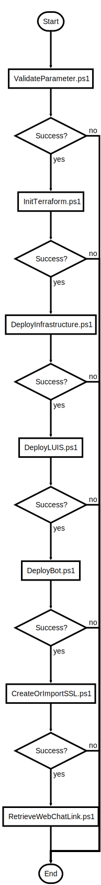

# OneClickDeploy.ps1

One Click Deployment for Geo Distributed Bot Solution

## Description

One Click Deployment for Geo Distributed Bot Solution

This script will do following steps:

1. Deploy Infrastructure
2. Deploy, train and publish LUIS
3. Deploy Bot Code
4. Create or Import SSL certificate and activate WebApps and TrafficManager endpoints

After the script is successfully executed the bot should be in a usable state

## Parameters

| Name | Type | Required | Default | Description |
| - | - | - | - | - |
| BOT_NAME | String | true |  | Unique Bot Name -> will be used as DNS prefix for CosmosDB, TrafficManager and KeyVault |
| BOT_REGIONS | String[] | false | @("koreacentral", "southeastasia") | Regions to deploy the Bot to  |
| BOT_GLOBAL_REGION | String | false | japaneast | Region used for global services  |
| YOUR_CERTIFICATE_EMAIL | String | false |  | Mail to be associated with Let's Encrypt certificate |
| YOUR_DOMAIN | String | false |  | The domain (CN) name for the SSL certificate |
| LETS_ENCRYPT_STAGING | Boolean | false | False | $True -> Use Let's Encrypt staging for script testing (Bot cannot be reached from Bot Framework Service)  |
| PFX_FILE_LOCATION | String | false |  | SSL CERT (PFX Format) file location |
| PFX_FILE_PASSWORD | String | false |  | SSL CERT (PFX Format) file password |
| AZUREFRONTDOOR | Boolean | false | False | Distribution Service: TrafficManager or Azure FrontDoor  |
| AUTOAPPROVE | Boolean | false | False | Terraform and SSL creation Automation Flag. $False -> Interactive, Approval $True -> Automatic Approval  |
| RERUN | Boolean | false | False | To change existing infrastructure, e.g. skips DNS check. $False -> first run/no infrastructure, $True -> subsequent run, existing infrastructure  |

## Examples

```powershell
.\OneClickDeploy.ps1 -BOT_NAME myuniquebot -YOUR_CERTIFICATE_EMAIL me@mymail.com -AUTOAPPROVE $True

.\OneClickDeploy.ps1 -BOT_NAME myuniquebot -YOUR_CERTIFICATE_EMAIL me@mymail.com -YOUR_DOMAIN bot.mydomain.com -AUTOAPPROVE $True

.\OneClickDeploy.ps1 -BOT_NAME myuniquebot -PFX_FILE_LOCATION ../../ssl.pfx -PFX_FILE_PASSWORD mostsecure -AUTOAPPROVE $True

.\OneClickDeploy.ps1 -BOT_NAME myuniquebot -PFX_FILE_LOCATION ../../ssl.pfx -PFX_FILE_PASSWORD mostsecure -YOUR_DOMAIN bot.mydomain.com -AUTOAPPROVE $True

```


## Related Scripts
- [ValidateParameter.ps1](ValidateParameter.md)

- [InitTerraform.ps1](InitTerraform.md)

- [DeployInfrastructure.ps1](DeployInfrastructure.md)

- [DeployLUIS.ps1](DeployLUIS.md)

- [DeployBot.ps1](DeployBot.md)

- [CreateOrImportSSL.ps1](CreateOrImportSSL.md)

- [RetrieveWebChatLink.ps1](RetrieveWebChatLink.md)


## Flowchart

<div align='center'>


</div>
