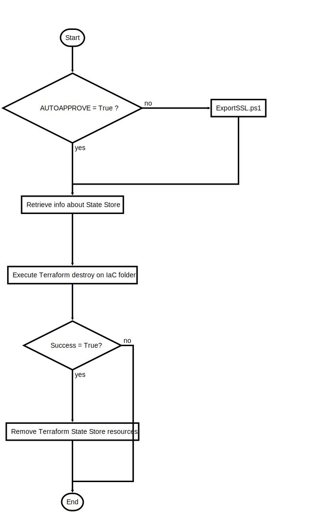

# OneClickDestroy.ps1

One Click Destroy for Geo Distributed Bot Solution

## Description

One Click Destroy for Geo Distributed Bot Solution

This script will do following steps:

1. Export Certificate to file [only if not in AUTOAPPROVE mode]
2. Destroy rest of environment with Terraform

After the script is successfully executed there should be nothing left

## Parameters

| Name | Type | Required | Default | Description |
| - | - | - | - | - |
| BOT_NAME | String | true |  | Unique Bot Name |
| BOT_REGIONS | String[] | false | @("koreacentral", "southeastasia") | Regions the Bot was deployed to |
| BOT_GLOBAL_REGION | String | false | japaneast | Region used for global services |
| PFX_FILE_LOCATION | String | false |  | SSL CERT (PFX Format) file location |
| KEYVAULT_CERT_NAME | String | false | SSLcert | KeyVault certificate key name |
| AUTOAPPROVE | Boolean | false | False | Terraform Automation Flag. $False -> Interactive and option to export SSL certificate, Approval $True -> Automatic Approval no export of SSL certificate |

## Examples

```powershell
.\OneClickDestroy.ps1 -BOT_NAME myuniquebot

.\OneClickDestroy.ps1 -BOT_NAME myuniquebot -AUTOAPPROVE $True

```


## Related Scripts
- [ExportSSL.ps1](ExportSSL.md)


## Flowchart

<div align='center'>


</div>
