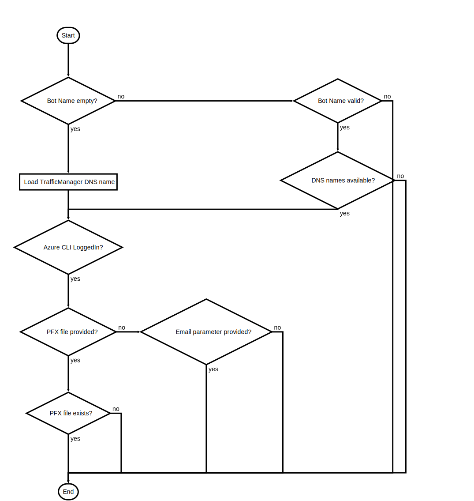

# ValidateParameter.ps1

Check for correct choice of Parameters and if Bot name is available

## Description

Check for correct choice of Parameters and if Bot name is available

This script will do following steps:

1. If Bot name provided check if Azure Services (KeyVault, CosmosDB, TrafficManager) are available under this name
2. Check if logged into Azure CLI
3. Check various combinations of possible parameters concerning the SSL certificate
-- if PFX_FILE_LOCATION is supplied file has to exist
-- -- if YOUR_DOMAIN is empty use _botname_.trafficmanager.net as Bot endpoint
-- -- if YOUR_DOMAIN is provided use this custom domain name as Bot endpoint
-- -- PFX_FILE_PASSWORD can be an empty password and therefore is always optional
-- if YOUR_CERTIFICATE_EMAIL is supplied
-- -- if YOUR_DOMAIN is empty issue SSL for _botname_.trafficmanager.net and use as Bot endpoint
-- -- if YOUR_DOMAIN is provided issue SSL for this domain name and use as Bot endpoint

After the script is successfully executed it should be ensured that the deployment should be succesful

## Parameters

| Name | Type | Required | Default | Description |
| - | - | - | - | - |
| BOT_NAME | String | false |  | Unique Bot Name -> will be used as DNS prefix for CosmosDB, TrafficManager and KeyVault |
| YOUR_CERTIFICATE_EMAIL | String | false |  | Mail to be associated with Let's Encrypt certificate |
| YOUR_DOMAIN | String | false |  | The domain (CN) name for the SSL certificate |
| PFX_FILE_LOCATION | String | false |  | SSL CERT (PFX Format) file location |
| PFX_FILE_PASSWORD | String | false |  | SSL CERT (PFX Format) file password |
| AUTOAPPROVE | Boolean | false | False | Terraform and SSL creation Automation Flag. $False -> Interactive, Approval $True -> Automatic Approval |
| ALREADYCONFIRMED | Boolean | false | False | Flag to determine if run from within OneClickDeploy.ps1 |
| RERUN | Boolean | false | False | To change existing infrastructure, e.g. skips DNS check. `$False -> first run/no infrastructure, `$True -> subsequent run, existing infrastructure |

## Examples

```powershell
.\ValidateParameter.ps1 -BOT_NAME myuniquebot -YOUR_CERTIFICATE_EMAIL me@mymail.com -YOUR_DOMAIN bot.mydomain.com

```


## Flowchart

<div align='center'>


</div>
