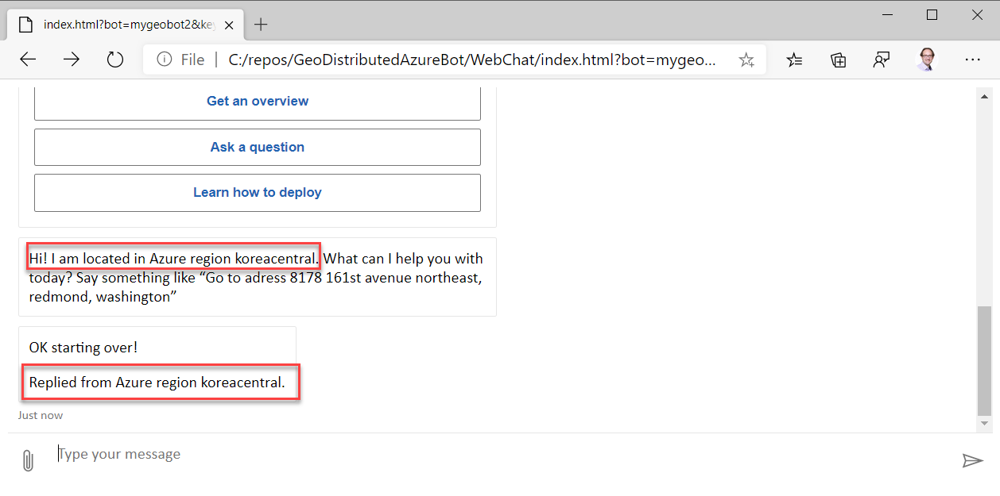

# Sample GeoBot

The provided sample bot is very simple. It will retrieve all of it's configuration values from a KeyVault.
The only static Application Settings provided (_region_ and _KeyVaultName_) from the WebApp are used to identify the KeyVault and some regionalized values.

## Bot features

The bot has two states (_Waiting_ and _Echo Intent_):

1. In _Waiting_ state it does nothing with the input but moves to _Echo Intent_  state
2. In _Echo _Intent_ state it echos the result of LUIS

The bot will always tell it's location from where it responded. You can use this to track/check if a failover succeeds and with which region you are connected to.

If you start the bot, it will be in _Echo Intent_ state).
You can achieve the _Waiting_ state by entering `cancel` in _Echo Intent_ state.
By any input in _Waiting_ state you will come back to _Echo Intent_ state.

If you connect with the Webchat, you have to enter something in order to get the bot active (see [here](https://github.com/microsoft/BotFramework-WebChat/issues/2120) why there is no automatic Welcome Message like with Emulator).
Here we are entering `cancel` in order to get the Bot into Waiting state

Here the result message of the bot. It will now accept any input but just switching to _Echo Intent_ state.

Here you see the message which indicates the _Echo Intent_ state. Now enter something else.

Now you will get the LUIS Json formatted result echoed back.

