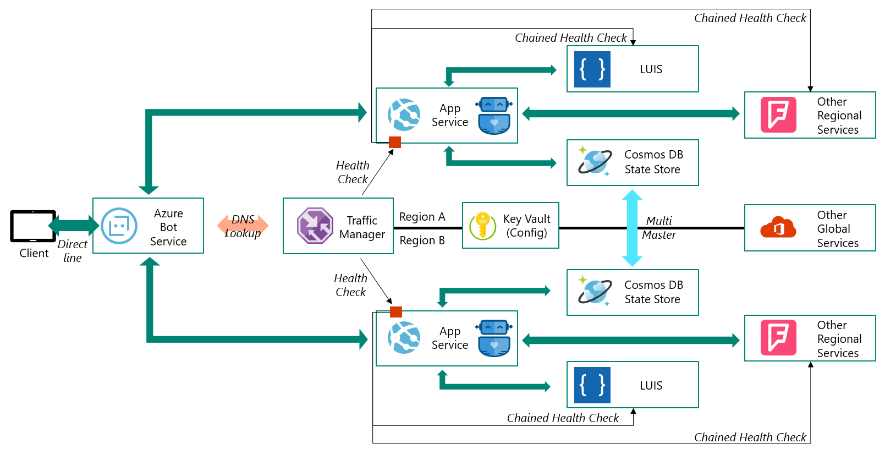

# Azure Bot Framework based Geo Distributed Bot with failover capability

This repo contains deployment scripts and a sample bot to spin up a geo distributed and geo failover capable bot, which can be accessed like any other Azure Bot Framework Service based bot via the Bot Framework Service Channels (Directline/WebChat and may more).

The idea of this repo is to give you a full working starting point for a Azure Cloud Native architecture pattern from where you can customize it for your Bot and your needs.

This repo focuses on the surrounding architectural aspects rather than to have a good conversational AI experience.

Things you can learn about (most are Bot unrelated):

- **Centralized and secure** configuration of services
- Simple but powerful **Auto-Failover** capabilities by cloud architecture design
- **Advanced Terraform** functionalities like __for_each__ and __dynamic__
- Fully **automated LUIS deployment** for CI/CD pipelines
- Automated Let's encrypt certification issuing

## Why should I care?

Most bot projects focusing on the user experience and natural language processing and other AI capabilities of the bot.
But as this bot becomes a main core service of your organization it will be critical that you can provide a **globally spanning bot service** and have a **integrated failover/always-on architecture** or strategy even in the (unlikely) downtime of a whole Azure region.

Since there is limited guidance on how to create such an architecture we started creating this repo as an idea book.

## The big picture

We don't claim that this is the only valid architecture. There are a lot of ways to build this and to customize and improve from this base architecture on.



### Architecture explanation

Your client apps or channels (Teams, Slack, Facebook Messenger) connect via the Azure Bot Frameworks Server (BFS), a already globally distributed service, to your bot. We configure BFS to use a Traffic Manager endpoint with 'Performance' mode. So Traffic Manager will lookup the bot which is nearest to the current connected BFS instance, which should be the same as the nearest to the client/user. TrafficManager is also capable of doing a healthcheck on the registered endpoints, which allows the regional failover by design.

Doing this comes actually with a price, BFS by design requires the Bot endpoint to have a valid trust chain SSL certificate in place, so we can not just create a self-signed SSL for a test run or demo.

In order to easily deploy the bot (and to be able to create a lean CI/CD pipeline), the bot(s) will reference a central configuration store, KeyVault to retrieve all configuration. The bot will be deployed as a .NET Core application into WebApps (on App Service).

For each region where we deploy a bot we also use the LUIS service in the same region to get a good latency. For storing the state of the conversations we are using CosmosDB in MultiMaster mode, so that even in case of failover the conversation can continue from the point where it was.

To ease out additional complexity overhead we introduced a healthcheck API within the bot which checks for availability of LUIS and CosmosDB. In case of one failure of one component the whole region will be failed-over which is maybe a bit harsh. You can extend each individual service to provide more regional failover and high availability, but as introduced we have to draw a line somewhere.

We are not using any other global or reginal services but for a better visualization they are displayed in the architecture picture.

### Design decisions

- Using TrafficManager with Performance profile in order to "dispatch" to the nearest available region/bot.
- Using KeyVault as central configuration store even for non-secret config (App Configuration Services can be used also but is still in preview and to keep the amount of services low)
- Using MultiMaster CosmosDB as state store, maybe you won't need a global MultiMaster CosmosDB, maybe for a bigger geographical region like North America or Europe separate CosmosDB MultiMaster clusters would be just fine.
- Placing all global services (management pane - Traffic Manager, Bot Registration) into a separate Azure region
- Putting the Healthcheck API within the bot (to reduce complexity/additional code and services)

## Try it yourself

Please report any problems you face under issues!

### Prerequisites for all tasks

> :information_source: Scripts are tested with PowerShell Core under Windows 10, Ubuntu 18.04.3 LTS ~~and [Azure Shell](https://shell.azure.com/)~~

- [PowerShell Core](https://docs.microsoft.com/en-us/powershell/scripting/install/installing-powershell?view=powershell-6) >=6.2.3
- [Terraform](https://learn.hashicorp.com/terraform/azure/install_az) >=0.12.18
- [Azure CLI](https://docs.microsoft.com/en-us/cli/azure/install-azure-cli?view=azure-cli-latest) >=2.0.71
- [.NET Core SDK](https://dotnet.microsoft.com/download/dotnet-core) >=2.2
- [Node.js & npm](https://nodejs.org/en/download/) >= 8.5
- [LUIS CLI](https://github.com/Microsoft/botbuilder-tools/tree/master/packages/LUIS) >=2.6.2 
- Be logged into Azure CLI and having Subscription Level Owner or Contributor rights on the "isDefault" marked subscription

### Summary of steps

1. Deploying the Infrastructure & Sample Bot (includes import or creation of an SSL certificate)
2. Testing Bot and Failover
3. Destroying the Infrastructure (and saving your SSL certificate for reuse)
4. Deploy it again

### 1. Deploying the Infrastructure & Sample Bot

You can use the OneClickDeploy.ps1 script, several options are available. (TODO explaining md file)

> :warning: For testing the provided automatic issuing of a `Let's Encrypt` certificate is a good way to overcome this, but it has rate limitations (top level domain 50 per week more info [here](https://letsencrypt.org/docs/rate-limits/)). Also currently there is no automatic way in place to renew the certificate automatically every 3 months. So use it wisely and try to reuse the SSL certificate. Even this architecture is capable of handling and be easily scaled out for production environments we strongly recommend a Custom Domain Name (with the current solution you can also issue a Let's Encrypt certificate for you custom domain - TODO explaining md file) and to use certificate issuing via [AppServices](https://docs.microsoft.com/en-us/azure/app-service/configure-ssl-certificate) or your preferred CA (Certificate Authority). :warning:

> :warning: Known issues/drawbacks:
> - __the Bot Name parameter has to be unique__ since several Azure services will use it as prefix. Stick to lowercase no dashes and special chars and less than 20char. e.g. **myfirstname1234**

> :information_source: You can change to `-AUTOAPPROVE $False` to accept / see the changes Terraform will do on your subscription. There are 3 to 5 executions so be prepared to enter yes in between. :information_source:

> :information_source: Without changing the parameters the bot will deploy to three Azure regions:
> - Global/central artifacts: __japaneast__
> - Bot: __koreacentral__ and __southeastasia__

> :information_source: To use a custom domain name you have just to set a CNAME entry in your DNS server pointing to the TrafficManager domain name (default `<botname>.trafficmanager.net`). See [here](https://docs.microsoft.com/en-us/azure/dns/dns-operations-recordsets-portal) on how to do it if you use Azure DNS.

```bash
# Example 1: Issues a SSL certificate from Let's Encrypt for the TrafficManager Endpoint Domain
# [HINT: Export your Certificate (see ExportSSL.ps1) for reuse in subsequent runs]
.\Deploy\OneClickDeploy.ps1 -BOT_NAME <yourbotname> -YOUR_CERTIFICATE_EMAIL <yourmailaddressforletsencrypt> -AUTOAPPROVE $True

# Example 2: Issues a SSL certificate from Let's Encrypt for your custom domain
# [HINT: Export your Certificate (see ExportSSL.ps1) for reuse in subsequent runs]
.\Deploy\OneClickDeploy.ps1 -BOT_NAME <yourbotname> `
 -YOUR_CERTIFICATE_EMAIL <yourmailaddressforletsencrypt> -YOUR_DOMAIN <yourdomain> -AUTOAPPROVE $True

# Example 3: Imports an existing SSL certificate (PFX File) for the TrafficManager Endpoint Domain
.\Deploy\OneClickDeploy.ps1 -BOT_NAME <yourbotname> `
 -PFX_FILE_LOCATION <path to pfx file> -PFX_FILE_PASSWORD <password of pfx file> -AUTOAPPROVE $True

# Example 4: Imports an existing SSL certificate (PFX File) for your custom domain
.\Deploy\OneClickDeploy.ps1 -BOT_NAME <yourbotname> `
 -PFX_FILE_LOCATION <path to pfx file> -PFX_FILE_PASSWORD <password of pfx file> `
 -YOUR_DOMAIN <yourdomain> -AUTOAPPROVE $True
```

### 2. Testing Bot and Failover

If the deployment script runs without any failures it will output generated links for accessing the WebChat locally or from within this repo's GitPage.

> :information_source: Alternatively you can grab your Directline key from the [Bot Channel Registration pane](https://docs.microsoft.com/en-us/azure/bot-service/bot-service-channel-connect-directline?view=azure-bot-service-4.0). 
Use the provided Test Webchat static [index.html](WebChat\index.html) and paste following query arguments
`?bot=<BOT_NAME>&key=<DIRECT_LINE_KEY>`


Last but not least break something (removing LUIS Endpoint Key in luis.ai, Stop the WebApp your bot responds from - TODO create sample scripts to do that)

### 3. Destroying the Infrastructure (and saving your SSL certificate for reuse)

With the execution of the below script you can save your SSL certificate and then delete all generated infrastructure:

```bash
# Example 1: Exports the SSL certificate as PFX File and destroys the infrastructure
.\Deploy\OneClickDestroy.ps1 -BOT_NAME <yourbotname>
```

### 4. Deploy it again

If you used the integrated Let's Encrypt certificate issuing please the saved certificate (it is valid for 3 months) for redeployments (if either you use the same Bot Name or Custom Domain for redeploy).

```bash
# Example 1: Imports an existing SSL certificate (PFX File) for the TrafficManager Endpoint Domain
.\Deploy\OneClickDeploy.ps1 -BOT_NAME <yourbotname> `
 -PFX_FILE_LOCATION <path to pfx file> -PFX_FILE_PASSWORD <password of pfx file> -AUTOAPPROVE $True

# Example 2: Imports an existing SSL certificate (PFX File) for your custom domain
.\Deploy\OneClickDeploy.ps1 -BOT_NAME <yourbotname> `
 -PFX_FILE_LOCATION <path to pfx file> -PFX_FILE_PASSWORD <password of pfx file> `
 -YOUR_DOMAIN <yourdomain> -AUTOAPPROVE $True
```

## Learnings

There is no __one fits it all__ Infrastructure as Code tool

- While Terraform is good for the loop over each region, it is not very good in multi step scenarios including waiting for a resource/artifact to be created
- Terraform also is less optimal if you want to introduce architecture choices
- For waiting I used script loops together with Azure CLI commands
- Terraform AzureRM provider still lacks some update features. E.g. there is a need to update only the Bot's endpoint in a subsequent Terraform execution, but this is not possible because there is no data source for Bot, so we would have to keep track of all parameters. In such cases we used Azure CLI for updating.
- Terraform is very convenient if you want to destroy the environment again (demos, non frequent reoccurring tasks)
- For real cross platform usage of PowerShell Core scripts you have to stick to unix file name/path conventions

## Open points and next steps

Listing up various things from different domain/view angles:

- Include prerequisite validation check
- Change from LUIS CLI to API calls in order to overcome Azure Shell restriction on npm executable packages
- Create additional documentation for all scripts and their options / deployment flow
- Update scripts and Terraform to use remote state store based on Blob Storage
- Extend Bot with Geo distributed Speech service
- Include scripts to simulate different type of failures
- Create a containerized version where AppService will be replaced with Azure Kubernetes Service or Azure Container Instances
- Create a version where LUIS and Speech service runs on the same AKS as the bot